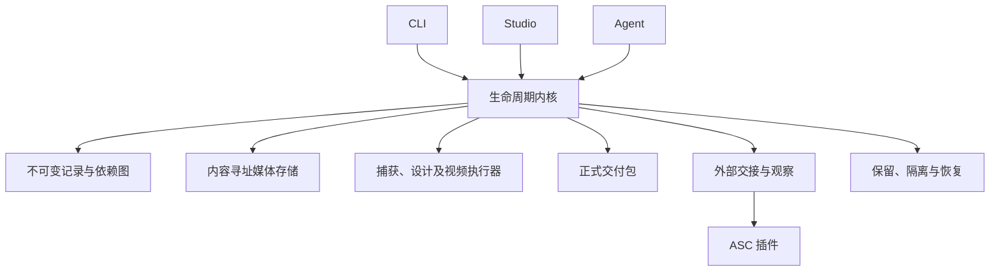
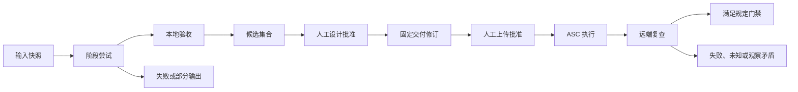

# ADR-002：统一产物生命周期与物料归档

**状态：** Proposed
**日期：** 2026-10-03
**决策责任人：** 插件维护者；消费项目负责人确认项目保留策略
**流程负责人：** 插件维护者
**复审周期：** 每季度，以及一次真实项目试运行后

## 设计范围与目标

本 ADR 从零定义 App Store Creative 的产物管理架构，不以已有代码、目录、版本或项目实践作为设计约束。范围覆盖输入接收、捕获、设计、试制、验收、选择、审批、正式交付、外部执行结果、保留、清理和恢复。

目标是回答每个文件的来源、用途、有效性、选用情况、保留理由及可恢复性。无论成功、失败、取消或进程中断，工作结束都必须形成可查询记录。物料应能跨机器取回、校验和用于后续修订。

非目标：App Store 应用构建、提交审核、生产发布、外部系统认证，以及多租户云平台。复现要求是保留准确的输入、配方和工具版本；最终批准字节单独保存，不依赖未来重新渲染获得相同字节。

## 架构决策

采用一个产物生命周期内核，CLI、Studio 和 agent 都是客户端。截图、视频、海报和证据使用统一的登记合同；媒体执行器负责生产，不能自行决定正式目录、审批或清理。

元数据使用不可变 JSON 记录，媒体使用内容寻址的本地对象存储。每个对象按 SHA-256 保存一份字节，业务实体引用它；工作中的临时文件独立隔离。读模型及索引可重建，不成为第二个权威。写入由内核序列化；第一版服务于单机、多进程工作区，不宣称支持共享网络盘上的分布式写入。

逻辑组件为：输入及配置快照、执行协调器、产物与依赖登记、媒体对象存储、验收与审批、交付包生成、外部交接及观察登记、保留及回收。运营策略通过版本化配置执行，不能散落在 agent 提示词和文件命名习惯中。

插件负责生产和证据合同，消费项目负责人负责产品选择和策略，外部系统插件负责其系统上的操作。Figma 是可选设计执行器，ASC 是远端执行器；两者不得直接改写本地候选、批准或完成状态。外部执行器返回事实，由生命周期内核验证后登记。



## 实体与权威

| 实体 | 含义及权威 |
| --- | --- |
| project_id | 稳定项目身份；由项目配置声明，不由目录名推断 |
| run_id | 一次工作目标的批次；配置、目标版本、工作流版本在启动时快照 |
| attempt_id | 一个阶段的一次执行；每次重试或输入改变生成新 ID |
| artifact | 一个文件及 SHA-256、字节数、媒体属性、生成者和输入依赖；哈希标识字节，不代替业务身份 |
| candidate | 选中的有序物料集合及本地验收；可发布候选变更时产生新的不可变清单 |
| release_revision | 固定目标、文案、物料及上传参数的交付修订；有 manifest_sha256，不在原地改写 |
| approval | 批准人、时间、范围及绑定的清单哈希；由人类授权产生，不能由文件存在推断 |
| publication | 某交付修订向明确 ASC 目标的一次操作；记录计划、执行回执、远端资源 ID和复查 |
| observation | 带时间、来源、观察对象及证据哈希的远端观察；相互矛盾的观察保留，不覆盖历史 |

审批、候选、交付和观察记录都是不可变事实。当前候选指针和 UI 状态是可重建投影。报告、列表、状态文件和 UI 均从相同记录派生，不提供直接修改完成布尔值的接口。

正式归档清单固定产物及配方。后续 publication、复查及事故记录以追加方式关联该清单，不能修改原归档的 manifest。创建日期或插件版本不充当 run_id；采用安全字符组成的 UUID/ULID，显示名称只是标签。

## 目录及输出合同

```text
creative.config.json
.creative/
  records/
    runs/<run-id>.json
    attempts/<attempt-id>/
      started.json
      outcome.json
    artifacts/<artifact-id>.json
    candidates/<candidate-id>.json
    approvals/<approval-id>.json
    deliveries/<revision-id>.json
    publications/<publication-id>/
      plan.json
      receipts/<receipt-id>.json
      observations/<observation-id>.json
    events/<event-id>.json
  objects/sha256/<prefix>/<sha256>
  work/<attempt-id>/
  views/
  maintenance/<operation-id>/
creative-releases/<project-id>/<platform>/<version>/<revision-id>/
  manifest.json
  recipe/
  evidence/
  media/<locale>/<device-target>/
```

状态根、对象根和交付根可配置，逻辑合同固定。对象文件没有业务含义的名字，名称、语言、顺序及使用角色由清单定义。用户查看和下载时通过清单获得友好文件名。导出包由清单复制媒体字节形成，能够脱离本机对象库使用。

所有执行器开始前领取 attempt，工作路径由内核分配。先写临时文件，验证媒体和哈希后原子提交对象，再登记引用；对象提交但登记失败时只是未引用对象，不能成为候选。记录登记失败必须报告，重试相同提交具有幂等性。失败或部分输出可登记为 partial；日志和工作空间诊断采用独立保留类别。

机器结果包含 schema_version、run_id、attempt_id、产物引用、验证结果及结构化失败原因。已结束的 attempt 不重写结果；继续执行创建新 attempt，并通过 replaces 或 retry_of 说明关系。收尾清理临时文件前必须登记需要保留的诊断数据。

媒体引用至少包含 artifact_id、sha256、size_bytes、media_type、角色、输入依赖和存储定位符。记录另含生产者身份、工具版本、输入快照、时间与验收引用。同一字节可以对应不同业务角色及来源，不能把内容去重误当作来源去重。

正式包使用内部相对路径，无绝对本机路径或外部对象库硬链接。包封存前完成复制和全量哈希检查；跨文件系统失败不产生有效交付记录。禁止路径逃逸、符号链接绕出允许根、非正规文件和不受管理的删除目标。

### 自定义目录配置合同

自定义目录属于完整实现范围，CLI、Studio 和 agent 使用相同的解析结果。项目在配置中声明逻辑根目录，内部批次、尝试、对象及修订结构由内核统一生成，不开放任意文件命名替代生命周期登记。

```json
{
  "storage": {
    "workspaceRoot": ".creative",
    "objectRoot": ".creative/objects",
    "releaseRoot": "release-assets/app-store",
    "publicationRoot": "release-assets/app-store-publications"
  }
}
```

上述为目录配置合同；具体实现状态与验收证据见 ADR-002-implementation-status.md。workspaceRoot保存运行记录、临时执行目录和可重建视图；objectRoot保存媒体对象；releaseRoot保存封存包；publicationRoot保存需要版本管理的脱敏交接和复查记录。内部运行回执仍在 workspaceRoot 中，向 publicationRoot 的导出由内核执行，不能形成两个可写事实源。

相对路径一律相对项目根解析，不受当前 shell目录影响，不自动展开环境变量或 shell表达式。项目外绝对路径仅在显式配置和运行环境授权下可用，缺省不会写入。该配置适用于本地文件后端；external媒体后端使用独立的对象定位配置，不能把 URI当作本地目录。

所有路径启动时规范化，按真实位置检查别名和符号链接。workspaceRoot允许包含objectRoot；releaseRoot和publicationRoot必须与工作区及对象库分离，彼此不得相等或互相包含。若objectRoot在工作区外，它也必须与其他根互不包含。任一根不得为项目根本身、仓库元数据目录或系统根。解析发现循环链接、逃逸或无权限时在创建文件前失败。

Git规则根据实际相对仓库路径生成：忽略工作根和工作根外对象库，对归档根和publicationRoot检查实际跟踪能力，LFS仅匹配配置的媒体目录。项目外根不生成伪造的仓库规则；Git只保留稳定定位符和必要清单。选择git/lfs媒体模式而归档位置在仓库外时必须明确导出到仓库，否则报配置冲突。

正式包内部引用仍为相对路径；本机路径配置不是媒体身份或批准身份。更换根目录对新run生效，既有run使用其记录的存储绑定，不静默重解释。移动既有受管理数据需要专门的relocate操作：生成计划、复制、校验并原子更新位置登记，失败时保留源目录；删除源数据仍遵循授权清理流程。纯位置变更不修改物料哈希或批准内容。

清理仅访问受管理登记中的工作对象及临时路径，不递归删除用户配置的整棵目录。对象隔离必须按所在存储后端提供可恢复操作，不能默认所有对象都在workspaceRoot。同一真实目录不能被不同项目重复声明为独占清理根；共享对象库需要显式共享模式和跨项目引用保护，在该能力实现前拒绝共享写入和回收。

目录配置验收包括：默认及自定义相对根、项目外绝对根、不同启动目录、包含空格或Unicode的路径、符号链接别名、根重叠、权限不足、Git忽略与LFS规则、自定义publicationRoot、跨文件系统对象隔离、根位置改变以及清理不触及未登记文件。CLI与Studio必须显示相同的最终路径和验证结果。

## 生命周期与完成门禁



不要用单一线性 status 表达全部事实。执行结果、是否选用、本地验收、审批、上传、播放、封面和清理状态分别记录。被替代必须带原因和替代引用；未选用不等于损坏，文件被清理也不等于没有历史。

远端验收策略绑定到交付修订及策略版本。截图检查身份、顺序、校验值、尺寸和可用状态；视频检查源文件绑定、完整播放证据及必要媒体属性；封面检查时间点和真实图片。远端 CDN 可解码、网页 UI 已显示、API 报告 COMPLETE 是不同证据种类，不得互相冒充。封面 URI 必须绑定到本次资源和设置；一个历史有效 URI不能证明当前设置已生效。

UNKNOWN 或 CONFLICT 均不能被视为 PASS。如果策略要求网页验证，CLI/CDN成功不能代替；若策略仅要求可用媒体，可通过资源绑定的权威字段和真实媒体验证，但同一设置下的矛盾仍需解释或消除。处理中的观察可以被后续观察自然取代；同一时段相同语义的矛盾不能按“最后一条成功”吞掉。远端通过结果带观察时间，不能承诺永久有效。

变更物料、顺序、文案、目标或封面上传参数会创建新修订，并重新绑定受影响的批准。产品负责人可明确授权一组允许的参数调整范围；代理只能在该范围内执行，不继承含糊的批准。纯粹重试同一个已批准计划可复用有效批准。

封面调整不强制重录或重新上传视频；新修订可引用旧媒体哈希，新 publication 记录 PATCH 和复查。无变更重复执行先查询远端状态，禁止把相同文件名当作幂等证明。

## 并发、恢复和原子性

阶段执行有 owner 和期限明确的执行租约；独立阶段并行，候选选择、审批绑定及晋级串行。写记录采用临时文件、原子替换及必要的文件锁；不得以目录存在当作成功锁。进程崩溃后记录 interrupted，保留部分文件，接管必须记录事件。

每次输出、晋级和交接都验证哈希；执行中的输入变化中止本次验收。ASC超时后先查询既有资源，再决定是否重试。远端资源 ID 不可用时保留 uncertain，不重新上传制造重复资源。

## Git、归档和成本

Git 是正式物料的审查、版本记录及协作入口。生命周期内核是物料身份、依赖、审批及验收的权威；Git commit、分支合并或 tag 存在不等于物料已经批准或远端可用。项目工作区和插件实现仓库分离：产品配置与物料进入消费项目仓库，通用 schema、执行器和流程进入插件仓库。

### 跟踪范围与默认规则

| 内容 | 默认管理方式 |
| --- | --- |
| creative.config.json、保留和存储策略 | Git；不得包含认证信息 |
| 正式交付 manifest、recipe、必要脱敏 evidence | Git，按不可变 revision 归档 |
| 最终媒体 | 显式选择 git、lfs 或 external，不从扩展名临时推断 |
| publication 的计划、脱敏回执及复查摘要 | Git 的独立追加记录，关联交付清单哈希 |
| .creative 的对象库、执行记录、索引、临时文件及日志 | 本地工作状态，默认忽略；需要持续保留的证据先导出 |
| 原始捕获、设计输入和录制素材 | 配方依赖；Git/LFS或可持久取回的独立存储，不能只留临时路径 |
| 令牌、私钥、登录状态、敏感样本、临时上传地址 | 不进入 Git 或公共归档 |

插件初始化只提出 Git 策略并生成可审查差异；不覆盖现有 .gitignore/.gitattributes，不运行自动 stage、commit、push 或历史重写。忽略规则应限定项目配置的工作目录，而不是全局忽略 *.png 或 *.mp4。已跟踪文件不会因新增忽略规则自动退出 Git；插件检测并报告，不自行删除或 untrack。

默认规则示例仅在工作根采用默认路径时适用：

```gitignore
/.creative/
```

正式归档根不得被工作目录忽略规则覆盖。初始化与交付封存前通过 Git 的实际忽略和跟踪结果检查，而不是只检查规则文本。日志或必要审批证据导出必须脱敏；无法安全导出时报告证据缺口，不能暗中提交整个工作区。

### 媒体存储策略与 LFS 合同

项目明确声明存储模式、媒体预算及存储后端。git 适合体积及累计历史可控的最终媒体；lfs 适合与仓库一起版本管理的大型二进制；external 适合独立容量与访问管理。插件记录当前及预估累计大小并提示预算风险，不自行启用付费服务。未配置必要媒体存储时可以试制，不能宣称归档可恢复。

使用 LFS 时，.gitattributes 必须先于媒体首次提交建立，并限定正式媒体和配置的源素材目录。例如：

```gitattributes
creative-releases/**/media/** filter=lfs diff=lfs merge=lfs -text
```

初始化检查 LFS 客户端、仓库过滤配置和远端支持；操作由项目维护者授权。已有 Git 大文件的历史转换不属于常规初始化，不自动执行。LFS 模式验收检查索引中的指针、LFS对象上传和从远端重新取回的实际媒体；最终验证对象的 SHA-256 与清单一致，不能将指针文本当作 PNG 或视频。检查缺失对象和 LFS预算/权限异常后阻断归档完成。

external 模式的 Git 清单保留稳定对象标识、版本、哈希、字节数和访问配置名称；凭证外置。预签名 URL、ASC播放地址或本机路径不能作为唯一恢复定位符。外部媒体须先持久保存并取回校验，再提交引用它的交付清单。

### PR、提交与交付修订

制作配置、配方、媒体变化及正式交付清单通过消费项目的 PR 规则审查，不硬编码分支名或合并方式。审查材料包含媒体预览、输入变化、文件哈希、验收结果及媒体大小；内容决定和上传许可仍以明确的人类批准范围为准，不把普通合并自动当作上传许可。

每个 revision 封存后，其 manifest、recipe、媒体和封存证据禁止原地覆盖。变化创建新 revision，通过 parent_revision 和替代原因说明关系；共享同一媒体哈希不要求再次生产。可变的当前版本索引只作为选择指针，更新必须在 PR 中可见。

清单可以记录产品 source_commit，但不得写入包含自身的 archive_commit，避免自引用循环。交付清单提交后，另行生成 publication/归档关联记录，记录 manifest_sha256、归档所在提交及实际远端目标。若 PR被 squash 或 rebase，以合并后的真实提交重新绑定并验证包内容，不能保留失效的预合并 SHA 当作最终归档身份。

Git追加记录使用独立路径，例如 creative-publications/<publication-id>/；不修改已封存包的证据目录。每个操作及观察文件不可变，新观察用新 ID追加。分支合并冲突不能通过选择某个完成布尔值处理，必须检查引用和清单。使用 release tag 时记录绑定，但不将可移动的 tag名称当作唯一身份。

### 克隆、恢复与交付门禁

提供统一的 archive verify/restore 用例：在干净工作区检出指定归档提交，读取清单和策略，取回 Git/LFS/external 媒体，校验全部必需字节和配方输入，再生成可使用的物料包。缺失凭证、对象未上传、哈希不符、配方依赖缺失和未展开 LFS指针均返回结构化错误；不回退到别的修订或 ASC下载来伪装恢复成功。

正式包应能独立用于重新上传；重制所需的输入和配方也必须持久定位。恢复结果分别报告包可用和制作依赖可用；两者满足归档策略才可标记 archive_verified。恢复制作环境不等于重渲染必然获得相同字节。

远端写入前必须将交付修订保存在持久存储，并绑定可恢复的归档提交。CI 可以执行清单、媒体、LFS指针和引用完整性检查，不上传、不提交审核。CI无法访问私有媒体时输出未验证，不能因此放宽门禁；可由受授权环境提供绑定相同清单哈希的恢复证据。

### Git 与清理边界

工作区回收只影响受管理的本地工作对象，不删除 Git跟踪的正式归档、不修改 LFS远端、不重写历史。已归档对象在本机缓存可被回收的前提是远端取回已验证，且不存在仍需该本地字节的活动任务或未结事故；清理不撤销归档引用。

正式归档退役通过明确审批和新的记录进行。Git历史、LFS对象和外部存储的永久删除是独立维护操作，需要评估所有引用、备份及恢复影响；普通 gc不得执行。删除工作树里的文件不会回收 Git历史或 LFS远端占用，容量报告必须区分本机对象、Git历史、LFS和外部存储。

Git相关验收必须包含：初始化保留现有规则；正式媒体不被误忽略；PR改变创建新修订；合并后提交绑定有效；缺失 LFS对象阻断；清单提交无自引用；空工作区取回及校验成功；本地清理不影响正式历史；归档策略与上传门禁一致。

## 运营流程与责任

| 步骤 | 执行 Responsible | 最终负责 Accountable | 协商 Consulted | 通知 Informed |
| --- | --- | --- | --- | --- |
| 声明输入和保留策略 | 项目 agent | 产品负责人 | 插件维护者 | 运营负责人 |
| 试制和本地验收 | Creative agent | 插件维护者负责机制 | 项目工程负责人 | 产品负责人 |
| 选用、设计批准 | Creative agent 整理；人类批准 | 产品负责人 | 设计/营销负责人 | ASC执行 agent |
| 固定归档及恢复校验 | Creative agent | 项目工程负责人 | 运营负责人 | 产品负责人 |
| 上传批准、ASC执行 | 人类批准；ASC agent执行 | 产品负责人 | Creative agent | 运营负责人 |
| 复查及问题闭环 | ASC agent采集；Creative agent汇总 | 产品负责人 | 项目工程负责人 | 插件维护者 |
| 保留、清理和恢复演练 | 项目授权的维护流程 | 项目负责人 | 运营及工程负责人 | 相关使用者 |

RACI 是职责分工，不额外制造审批角色。单人项目可以由同一人承担多个职责。插件不自行建立后台清理或定时任务。

每次工作结束执行收尾：登记所有产物；标注失败和替代原因；输出当前候选、归档和远端状态；列出可回收大小和待处理问题。失败工作同样必须可查。新文件可以暂时处于 unregistered，但收尾必须发现并报告；这类文件不得自动进入交付或直接删除。

## 保留、清理与恢复

建议默认策略供项目确认：未选用且终止的试制媒体保留30天；大型调试日志保留14天；候选、审批、上传、事故所引用的数据持续保护。正式发布版本保留到产品负责人明确批准退役；审批、交付清单和关键审计记录持续保留。时长属于项目策略而非插件硬编码。

清理先生成 dry-run 清单，包含每项大小、理由、引用关系和策略版本。仅回收终止、未被候选/交付/批准/未结事故/活动租约引用的对象。执行时重新校验图和哈希，防止计划生成后新增引用；遇到锁或引用变化取消相关项。

默认将回收对象及位置变更写入受管理的隔离事务，保留恢复索引，建议保留7天；隔离不移除业务记录。共享对象必须确认所有引用均已释放；跨文件系统移动必须复制、校验后再处理源文件。永久删除必须由项目授权的维护动作明确执行，不随普通 export 或退出自动发生。未登记文件一律 report-only；保护缺失文件的引用，不能假装清理成功。

定期抽样从正式归档恢复，验证清单、媒体、配方及外部存储访问。失败时暂停该存储上的清理，并生成事故记录。已批准修订不会因本地淘汰其它尝试而失效。

## 异常处理

| 场景 | 处理 |
| --- | --- |
| 验收失败 | 记录原因和可用的部分输出；新尝试修复，保留旧记录 |
| 多份远端证据矛盾 | 状态 CONFLICT，保存来源和观察时间，安排针对性复查 |
| 请求超时但可能已经上传 | 查询绑定的资源/校验值，保持 uncertain，避免直接重复上传 |
| 批准后修改物料或封面 | 创建新修订，保留旧批准，按明确范围重新授权 |
| agent 中断 | 记录 interrupted，过期租约接管，既有成功阶段不重复执行 |
| 原始素材含敏感内容 | 隔离访问，归档脱敏摘要，按项目策略处置原件 |
| 清理中崩溃 | 依据操作日志和隔离索引恢复或继续，不按目录名猜测 |
| 外部输入缺少来源 | 标记 provenance-unknown，按验收策略阻断；不伪造批准或生产记录 |

## 选项与取舍

| 选项 | 复杂度 | 成本与规模 | 结论 |
| --- | --- | --- | --- |
| 自由目录+手工报告 | 低起步，长期高维护 | 容易重复和失去归属 | 不采用 |
| 不可变记录+内容寻址存储+统一生命周期内核 | 中等 | 单机多进程规模足够；可审查和独立归档 | 推荐 |
| 数据库+对象存储服务 | 高 | 适合长期多机共享，但增加部署、权限和备份负担 | 暂缓 |

代价是增加记录和引用校验；收益是能够安全收尾、清理、恢复及准确报告。内容寻址去重、引用保护和基础占用统计属于完整交付要求；分布式存储、跨团队共享及高级分析另行评估。

## 接口与使用合同

以下为目标命令设计，不表示当前已经实现：

```text
creative run start
creative attempt start
creative artifact register
creative candidate select
creative validate
creative approval record
creative delivery seal
creative publication plan
creative observation record
creative status
creative inventory
creative gc plan
creative gc quarantine
creative gc restore
creative gc purge
creative archive verify
```

CLI 和 Studio 调用相同用例，不各自实现文件写入和状态规则。变更调用包含对象版本或前置哈希；并发条件不匹配返回 conflict。外部交接包含确切目标、清单哈希、批准范围、操作幂等键及所需回执 schema。未知字段版本拒绝写入，不能静默忽略关键证据。

## 完整实现范围与验收标准

1. 实体 schema、记录仓库、内容寻址对象存储、锁及原子提交；同时实现 storage 目录配置、统一路径解析及根边界校验。
2. 输入快照、阶段执行、输出登记、依赖失效、失败及中断恢复。
3. 候选选择、验证策略、批准范围、不可变修订及独立交付包。
4. 外部交接、回执和观察绑定，按策略派生完成状态。
5. 状态查询、inventory、存储占用统计、未登记文件检测。
6. 引用图保护、保留策略、清理计划、隔离、恢复和永久删除。
7. CLI、Studio、agent 工具合同，以及使用说明、收尾 SOP 和恢复演练。
8. Git 跟踪合同、LFS/external 校验、PR及提交绑定、干净克隆恢复和CI只读门禁；忽略与媒体规则从目录配置生成。
9. 自定义根的端到端验收、存储位置绑定及显式 relocate；将目录配置同步纳入 CLI、Studio、交接和维护操作。

这些是同一架构的完整职责，不以历史兼容或迁移作为交付项。实现顺序按依赖由底层存储至生产、交付、外部验收和维护推进；只有全链路通过验收才能称为统一产物管理完成。

必须验证：重试不会覆盖前次输出；相同字节只存一份且保留不同来源；输入改变只使真实依赖失效；批准对象不可变；交付包可在空工作区独立读取；并发提交不交叉覆盖；部分提交和中断可恢复；共享对象清理不破坏引用；清理计划过期时拒绝危险项；路径逃逸被拒绝；远端请求成功但证据缺失不能通过；不重复上传；CLI 与 Studio 对同一操作产生相同业务结果。

验收采用两个不同产品的独立工作区，以及涵盖截图、视频和海报的场景矩阵；具体产品不进入内核模型。至少完成一次完整试制到远端验证，以及一次失败、取消、重试、隔离、恢复和归档取回演练。

## 运营指标与验收

| 指标 | 初期目标 | 采集方法 |
| --- | --- | --- |
| 正式交付来源完整率 | 100% | 清单输入依赖和哈希检查 |
| 引用数据被误清理次数 | 0 | 清理审计与恢复验证 |
| 完成状态与证据矛盾次数 | 0 | 门禁测试及事故复盘 |
| 工作结束未登记产物 | 0，异常必须报告 | inventory |
| 归档恢复成功率 | 抽样100% | 独立恢复及哈希检查 |
| 工作区媒体占用 | 先建立基线，不设任意硬阈值 | 按 run、阶段、结果统计字节 |

本 ADR 定义目标架构，状态仍为 Proposed；设计完成不等于能力已实现。实施计划及发布安排另行制定，不改变本 ADR 的模型和完成标准。
